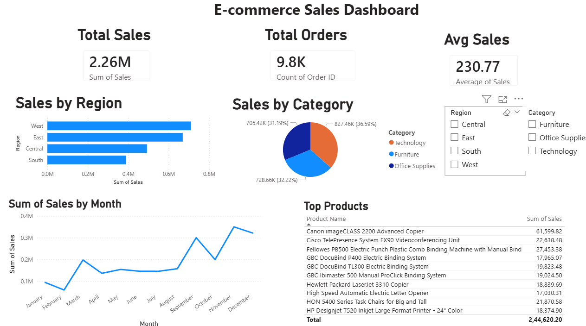

# E-commerce Sales Analysis

## 📊 Overview
Analyzed 9,800+ sales records using Python, SQL, and Power BI.

## 🛠 Tools Used
- Python (Pandas)
- SQL (MySQL)
- Power BI

## 📈 Key Insights
- Technology category generates highest revenue
- Top products drive majority of sales
- Sales show monthly trends
- Average delivery time ~4 days

## 📊 Dashboard

